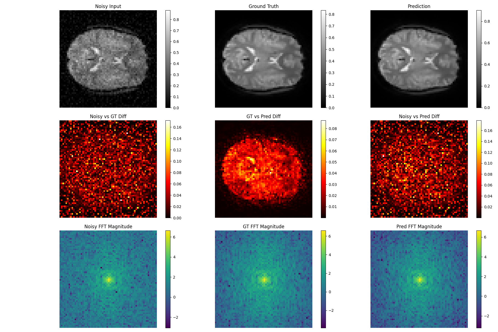

# fMRI Image Denoising Training Pipeline (w FFT Loss)



This project provides a training pipeline for medical image data in NIfTI format (`.nii.gz`). The pipeline is designed for flexibility and easy experimentation using Jupyter Notebooks.

## 📁 Folder Structure

```
project-root/
│
├── unet
│   ├── dataset.py
│   ├── eval.py
│   ├── model.py
│   ├── util.py
├── fmri.ipynb
├── train_model.py
├── train_model_visual.py
├── environment.yaml
├── README.md
├── data/                 # Folder for training data
│   ├── case1.nii.gz
│   ├── case2.nii.gz
│   └── ...
├── validation/           # Folder for validation data
│   ├── val1.nii.gz
│   ├── val2.nii.gz
│   └── ...
```

## 🚀 Getting Started

### 🛠 Requirements

Make sure to install all dependencies, including:

- Python 3.8+
- NumPy
- PyTorch
- Nibabel
- Matplotlib
- scikit-learn
- Jupyter

### 🧪 Creating a Conda Environment

To create a Conda environment with all required dependencies:

1. Ensure you have Miniconda or Anaconda installed.
2. Run the following command from the project directory:

```bash
conda env create -f environment.yml
```

3. Activate the environment:

```bash
conda activate fmri
```

### 📋 Setup Instructions

1. **Prepare Your Data**
   - Place your training `.nii.gz` files in the `data/` folder.
   - Place your validation `.nii.gz` files in the `validation/` folder.

2. **Customize Parameters**
   You can customize various training parameters inside the notebook:
   - **Learning Rate**
   - **Optimizer**
   - **Batch Size**
   - **Number of Epochs**
   
   Modify these settings in the notebook to experiment with different training configurations.

3. **Train the Model**
   Run the `train_model_visual.py` file to:
   - Load and preprocess the data
   - Set up the model and training parameters
   - Train the model
   - Evaluate the results on the validation set

4. **Train the Model [optional]**
   Run the `fmri.ipyb` Notebook to:
   - Load and preprocess the data
   - Set up the model and training parameters
   - Train the model
   - Evaluate the results on the validation set
  
5. **CHECKPOINT**

   Checkpoint can be downloaded from `https://huggingface.co/AquaKnauf/fmri-denoise/tree/main`

   OR

   You can easily download the trained model weights directly from the Hugging Face Hub using the `huggingface_hub` Python library:

   To download the pre-trained model from Hugging Face Hub:
   
   ```python
   from huggingface_hub import hf_hub_download
   
   model_path = hf_hub_download(
       repo_id="AquaKnauf/fmri-denoise",
       filename="model_weights_epoch6.pth"
   )
   ```
   
   Make sure you have huggingface_hub installed:
   
   ```bash
   pip install huggingface_hub
   ```

## 📈 Output

- All training updates (loss, metrics, etc.) will also be available in **TensorBoard** for interactive visualization.
- You can modify the `train_model_visual.py` to save:
  - Trained models
  - Prediction outputs
  - Log files

 ---

## 🧪 Evaluation Results

After training, the model for 6 Epochs achieved the following performance on the validation set:

- **MSE**  : `0.000090`  
- **PSNR** : `40.51 dB`  
- **SSIM** : `0.9923`

### ✅ How to Use (via Web UI)
Go to the Hugging Face Space, upload a .nii.gz fMRI file (4D shape: X × Y × Z × T), and click Submit. The model will return a denoised .nii.gz file.

### 🔁 API Access (Programmatic)
You can also call the API programmatically using the Gradio Client:

   ```python
   from gradio_client import Client
   
   client = Client("AquaKnauf/fMRI-Denoise-Api")
   result = client.predict(
       "sub-01_task-rest_bold.nii.gz",  # path to your 4D fMRI file
       api_name="/predict"
   )
   
   # Save the denoised output
   with open("denoised_output.nii.gz", "wb") as f:
       f.write(result)```
---


### 📦 Input
.nii.gz file (4D fMRI, shape: X × Y × Z × T)

### 📤 Output
.nii.gz file with the same shape, denoised
